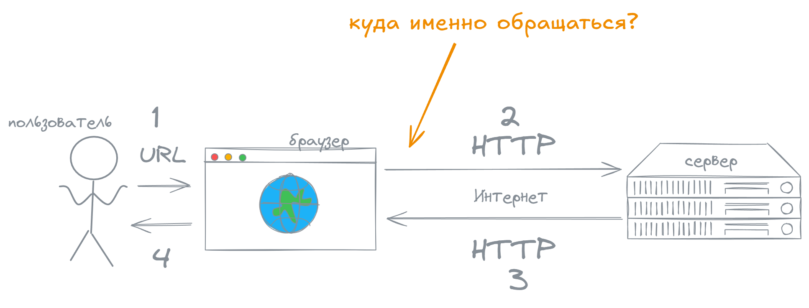

import { Card, FileTree, LinkCard, TabItem, Tabs } from '@astrojs/starlight/components';
import MultipleChoice from '../../components/MultipleChoice.astro';
import Option from '../../components/Option.astro';


В этой главе мы рассмотрим

- определение API
- асинхронность JavaScript
- запрос `fetch...then`
- кластеризацию точек на карте
- связку элементов веб-страницы с картой

В рамках практической части создадим карту вакансий на основе изменяющегося содержания онлайн-таблицы. При желании посмотрите [полный код](https://github.com/gtitov/sheet-maplibre-map) и [возможный результат](https://gtitov.github.io/sheet-maplibre-map/).
 

## API

API обычно переводят как прикладной программный интерфейс или программный интерфейс приложений. На практике чаще говорят просто "апи".

Помните формулировку из предыдущего упражнения

> ...клиент (браузер) обращается к серверу с запросом, сервер возвращает клиенту ответ



Откуда браузер знает, куда обращаться?

Мы написали, куда ему нужно обращаться.

А откуда мы знаем?

Мы знаем, потому что ожидаем, что при обращении к определённому *адресу* (URL) нам вернётся определённый ответ. Например, при обращении за файлом `style.css` мы получим стили, потому что сами и создали этот файл.

<Card title="API">Совокупность *адресов* (URL) и правил обращения к ним называется API. Отдельные адреса называются методами API или, в обиходе, ручками API.</Card>

В идеале API будет иметь интуитивно понятное назначение и описание каждого метода. 

> Про то, как этого добиться написана не одна книга. Но помните, сложно понять, что такое хорошо и что такое плохо, без практики, поэтому для начала надо дерзать и пробовать.

Существуют стандарты API. Обращаясь к API, который следует стандарту пользователь знает, чего ему ожидать.

> Ряд стандартов API существует для пространственных и картографических данных. Мы уже использовали стандартный формат обмена GeoJSON и видели, что MapLibre принимает его без необходимости предварительной обработки. К другим популярным стандартам следует отнести протоколы WMS, WFS, векторные тайлы. Ряд стандартов курирует Открытый Геопространственный Консорциум (Open Geospatial Consortium), некоторые приняты как стандарты ISO и ГОСТ.

Подключая источники данных, мы тоже использовали API, просто вызовом необходимых методов занималась библиотека MapLibre.

## Заготовка для карты

Попробуем обратиться к публично доступным методам API Google-таблиц, а именно загрузить данные таблицы в формате CSV.

Для начала по аналогии с первым упражнением создадим заготовку для карты из файлов `index.html`, `style.css`, `main.js`.

<Tabs>
  <TabItem label="HTML">
    ```html title="index.html"
    <!DOCTYPE html>
    <html lang="en">

    <head>
        <meta charset="UTF-8">
        <meta name="viewport" content="width=device-width, initial-scale=1.0">
        <title>Карта вакансий</title>
        <link rel="stylesheet" href="style.css">
        <script src="https://unpkg.com/maplibre-gl@latest/dist/maplibre-gl.js"></script> 
        <link href="https://unpkg.com/maplibre-gl@latest/dist/maplibre-gl.css" rel="stylesheet" />
    </head>

    <body>
        <div id="map"></div>
        <script src="main.js"></script>
    </body>

    </html>
    ```
  </TabItem>
  <TabItem label="CSS">
    ```css title="style.css"
    #map {
        position: absolute;
        top: 0;
        bottom: 0;
        left: 0;
        right: 0;
    }
    ```
  </TabItem>
  <TabItem label="JavaScript">
    ```js title="main.js"
    const map = new maplibregl.Map({
      container: 'map',
      style: "https://raw.githubusercontent.com/gtitov/basemaps/refs/heads/master/positron-nolabels.json",
      center: [51, 37],
      zoom: 4
    });
    ```
  </TabItem>
</Tabs>

<Card title={'Строка <code>&lt;div id="map">&lt;/div></code> это'}>
    <MultipleChoice>
      <Option isCorrect>
        контейнер для карты
      </Option>
      <Option>
        инициализация карты
      </Option>
      <Option>
        стиль карты
      </Option>
    </MultipleChoice>

    <details>
      <summary>Развёрнутый ответ</summary>
      Этой строкой мы размечаем контейнер для карты в HTML-файле. В JavaScript-файле мы обращаемся к этому контейнеру по `id`
    </details>
</Card>

Удостоверимся, что карта отображается на локальном сервере.

> Вспомнить, как запустить локальный сервер, можно [тут](/2-webmap/#запуск-локального-сервера).

## Обращение к API

Выполним запрос и выведем в консоль ответ

```js title="main.js"
map.on("load", () => {
  const response = fetch("https://docs.google.com/spreadsheets/d/1f0waZduz5CXdNig_WWcJDWWntF-p5gN2-P-CNTLxEa0/export?format=csv")
  console.log(response)
})
```

> Сюжет с асинхронностью может показать контринтуитивным. Это нормально. Почитайте теорию, попрактикуйтесь, вернитесь к теории, можно поглядеть материалы из раздела [Чтение](#чтение). И всё получится! Проверено.

### Асинхронность

В консоль браузера вывелся *Promise* -- обещание того, что браузер уже занимается нашим запросом. Ответ от сервера не вывелся, хотя во вкладке "Сеть" в инструментах разработчика мы видим, что данные браузер запросил и получил. Дело в том, что вывод в консоль был выполнен раньше, чем мы получили ответ от сервера.

Браузер начал исполнять наш код, увидел запрос к внешнему ресурсу и подумал: "Здесь можно завязнуть. Ещё неизвестно, сколько этот внешний ресурс будет отвечать. Я сейчас отправлю запрос, а пока верну обещание, что когда будет ответ, я его предоставлю. А пока жду ответа буду дальше код выполнять."

Другими ~более умными~ словами, запрос к внешнему ресурсу выполняется асинхронно, то есть изымается из последовательного выполнения программного кода и выполняется отдельно. Поэтому вывод в консоль выполняется раньше того, как данные получены.

### Работа с асинхронностью

Для асинхронных запросов мы должны в явном виде указать, что код, использующий запрашиваемые данные, должен выполняться после получения ответа на запрос. Для этого используем конструкцию `fetch...then`

```js title="main.js" showLineNumbers
map.on("load", () => {
  fetch("https://docs.google.com/spreadsheets/d/1f0waZduz5CXdNig_WWcJDWWntF-p5gN2-P-CNTLxEa0/export?format=csv")
    .then((response) => response.text())
    .then((csv) => console.log(csv))
})
```

> Можно запрашивать эту таблицу, но лучше скопировать её себе. Тогда можно будет менять данные, а этом и есть интерес этого упражнения. Чтобы открыть таблицу уберите из URL часть `/export?format=csv` или воспользуйтесь этой [ссылкой](https://docs.google.com/spreadsheets/d/1f0waZduz5CXdNig_WWcJDWWntF-p5gN2-P-CNTLxEa0). Чтобы потому запросить свою таблицу в формате CSV, добавьте в конец `/export?format=csv`, чтобы URL был похож на тот, что в коде выше.

`fetch` выполняет запрос и возвращает Promise (1) -- обещание, что дождётся ответа от внешнего ресурса с csv-данными о вакансиях.

`then` получает Promise (1) и сразу возвращает новый Promise (2) -- обещание, что обработает ответ от Promise (1) с помощью заданной функции `(response) => response.text()`. Эта функция извлечёт текст из ответа от Promise (1).

Следующий `then` получает Promise (2) и сразу возвращает Promise (3). Этот Promise (3) в нашем случае никуда не идёт. Заключительный `then` дождётся исполнения предыдущих Promise (1) и (2) и обработает итоговый ответ функцией `(csv) => console.log(csv)`, то есть выведет полученный от Promise (2) текст в консоль.

> Попробуйте перечитать это, заменив слово Promise на слово Обещание. Иногда становится понятнее.

### Асинхронность внутри карты

В первой карте тоже был асинхронный код!

Сама карта создаётся асинхронно, поэтому все действия по добавлению слоёв мы выполняем после загрузки карты `map.on('load', () => {})`. Функция, которая вызывается после успешного завершения события, в данном случае `'load'` называется колбэк (callback) функцией. Колбэк -- это ещё один вариант работы с асинхронностью.

А ещё асинхронно выполняется добавление источников данных `map.addSource`, они же тоже фактически загружаются с сервера. В этом случае библиотека MapLibre сама отслеживает, что код по добавлению источника должен завершиться, прежде чем мы сможем создавать картографические слои `map.addLayer` из этого источника. Спасибо ей за это!

## Преобразование данных

MapLibre не может работать с форматом CSV. Мы преобразуем данные в знакомый формат GeoJSON.

Подключим библиотеку для чтения CSV данных в JS-объект.

```html title="index.html"
<head>
  ...
  <script src="https://unpkg.com/papaparse@5.4.1/papaparse.min.js"></script>
</head>
```

Выполним чтение CSV данных c использованием подключенной библиотеки и сконструируем GeoJSON-объект.

```js title="main.js" del={1}
.then((csv) => console.log(csv))
.then((csv) => {
  const rows = Papa.parse(csv, { header: true }) // читаем CSV
  // console.log(rows) // любуемся
  // Формируем объекты GeoJSON
  const geojsonFeatures = rows.data.map((row) => {
    return {
      type: "Feature",
      properties: row,
      geometry: {
        type: "Point",
        coordinates: [row.lon, row.lat],
      }
    }
  })
  const geojson = {
    type: "FeatureCollection",
    features: geojsonFeatures
  }
})
```

Полученный GeoJSON используем в качестве источника данных для нашей карты.

## Добавление и кластеризация точек

У нас есть заготовка, есть данные, самое время заняться картой!

```js title="main.js"
.then((csv) => {
  // ...
  const geojson = {
    type: "FeatureCollection",
    features: geojsonFeatures
  }

  map.addSource("vacancies", {
    type: "geojson",
    data: geojson,
    cluster: true, // точки будем объединять в кластеры
    clusterRadius: 20, // радиус поиска 20 пикселей
  });

  map.addLayer({
    id: "clusters",
    source: "vacancies",
    type: "circle",
    paint: {
      "circle-color": "#7EC8E3",
      "circle-stroke-width": 1,
      "circle-stroke-color": "#FFFFFF",
      "circle-radius": [
        "step", ["get", "point_count"],
        12, // до 3 точек в кластере
        3,  // --- первое граничное значение
        20, // от 3 точек до 6
        6,  // --- второе граничное значение
        30  // больше 6 точек в кластере
      ],
    },
  });

  map.addLayer({
    id: "clusters-labels",
    type: "symbol",
    source: "vacancies",
    layout: {
      "text-field": ["get", "point_count"],
      "text-size": 10,
    },
  });
})
```

## Связка карты и веб-страницы

Чаще всего карту сопровождают дополнительные элементы веб-страницы. Для этой карты мы приведём список всех вакансий и список вакансий, которые пользователь видит на карте при текущем охвате.

### Разметка списков

Разметим этим спискам место на веб-странице.

```html title="index.html"
<body>
    <div id="map"></div>
    <div id="list-selected"><h2>Сейчас на карте</h2></div>
    <div id="list-all"><h2>Все вакансии</h2></div>
    <script src="main.js"></script>
</body>
```

И зададим оформление.

```css title="style.css"
h2 {
    margin: 10px;
}

.list-item {
    padding: 10px;
}

#map {
    position: absolute;
    top: 0;
    bottom: 0;
    right: 300px;
    left: 300px;
}

#list-selected {
    position: absolute;
    top: 0;
    bottom: 0;
    left: 0;
    width: 300px;
    overflow-y: auto;
}

#list-all {
    position: absolute;
    top: 0;
    bottom: 0;
    right: 0;
    width: 300px;
    overflow-y: auto;
}
```

Теперь на нашей веб-странице выделено место под списки. Плюс мы добавили оформление для заголовков второго уровня `h2` и создали класс `.list-item` для будущих элементов списка.

### Список всех вакансий

Сначала наполним список всех вакансий. Это нужно сделать единожды.

```js title="main.js"
.then((csv) => {
  // ...
  geojson.features.map((f) => {
    document.getElementById(
      "list-all"
    ).innerHTML += `<div class="list-item">
    <h4>${f.properties["Вакансия"]}</h4>
    <a href='#' onclick="map.flyTo({center: [${f.geometry.coordinates}], zoom: 10})">Найти на карте</a>
    </div><hr>`;
  });
})
```

### Список видимых вакансий

А список вакансий, которые видит пользователь при заданном охвате карты, надо будет обновлять при каждом перемещении по карте. Мы будем реагировать на окончание перемещения. Ещё одной сложностью является необходимость извлечь из каждого кластера сведения о том, какие объекты в него входят. Со всем этим мы прекрасно справимся.

```js title="main.js"
.then((csv) => {
  // ...
  map.on('moveend', () => {
    const features = map.queryRenderedFeatures({
      layers: ["clusters"]
    })

    document.getElementById("list-selected").innerHTML = "<h2>Сейчас на карте</h2>"


    features.map(f => {
      if (f.properties.cluster) {
        map.getSource("vacancies").getClusterLeaves(
            clusterId = f.properties.cluster_id,
            limit = f.properties.point_count,
            offset = 0
        )
          .then((clusterFeatures) => {
            clusterFeatures.map((feature) => document.getElementById("list-selected")
              .innerHTML += `<div class="list-item">
              <h4>${feature.properties["Вакансия"]}</h4>
              <a target="blank_" href='${feature.properties["Ссылка на сайте Картетики"]}'>Подробнее</a>
              </div><hr>`)
          });
      } else {
        document.getElementById("list-selected")
          .innerHTML += `<div class="list-item">
          <h4>${f.properties["Вакансия"]}</h4>
          <a target="blank_" href='${f.properties["Ссылка на сайте Картетики"]}'>Подробнее</a>
          </div><hr>`
      }
    })
  })
})
```

## Пара UX-штрихов

Для удобства пользования картой добавим приближение к карте по клику на объект и изменение курсора при наведении на слой.

```js title="main.js"
map.on("load", () => {
  // ...
  .then((csv) => {
    // ...
  })

  // Эти события мы назначаем, пока ждём ответа от внешнего ресурса.
  // Не теряем ни секунды.
  map.on("click", "clusters", function (e) {
    map.flyTo({ center: e.lngLat, zoom: 8 });
  })

  map.on("mouseenter", "clusters", function () {
    map.getCanvas().style.cursor = "pointer";
  });

  map.on("mouseleave", "clusters", function () {
    map.getCanvas().style.cursor = "";
  });
})
```

На протяжении упражнения мы использовали события `load`, `moveend`, `click`, `mouseenter`, `mouseleave`. Полный список доступных событий можно узнать в [документации](https://maplibre.org/maplibre-gl-js/docs/API/type-aliases/MapEventType/).

## Что мы получили

Проделана прекрасная работа!

При желании посмотрите [полный код](https://github.com/gtitov/sheet-maplibre-map) и [возможный результат](https://gtitov.github.io/sheet-maplibre-map/).

После первичной загрузки карты мы делаем следующее:

1. выполняем запрос к внешнему ресурсу -- по API получаем CSV-файл из Гугл таблицы,
1. дожидаемся ответа, используя конструкцию `fetch...then`,
1. обрабатываем его -- конвертируем CSV в GeoJSON,
1. добавляем полученный GeoJSON как источник данных на карту,
1. создаём на основе этого GeoJSON кластеризованный слой
1. используем исходный GeoJSON для формирования списка всех объектов с возможностью поиска по карте
1. используем слой вакансий на карте для формирования списка видимых объектов

Такая карта хороша, когда нужно организовать совместную работу с обновляемыми пространственными данными. Например, на этой основе мне приходилось делать карту для выставки. Специалисты заполняли таблицу в своём темпе, а на основе содержания этой таблицы генерировалась карта, прямо как в этом упражнении. Главное заранее договориться о структуре таблицы. Такую карту можно разметить в Интернете практически бесплатно, потому что динамическая составляющая сайта обеспечивается бесплатным сервисом таблиц.

## Упражнения

1. Поменяйте местами списки
2. Сделайте так, чтобы цвет кластера зависел от количества элементов внутри него
3. Сделайте, чтобы до первого перемещения карты список вакансий "Сейчас на карте" тоже был заполнен
<details>
<summary>Маленькая подсказка для третьего 🧙‍♀️</summary>
Нужно найти подходящее [событие карты](https://maplibre.org/maplibre-gl-js/docs/API/type-aliases/MapEventType/) вместо <code>map.on("moveend", () => \{\})</code>
</details>
<details>
<summary>Большой подсказ для третьего 🧙‍♂️</summary>
Можно использовать метод <code>map.on("idle", () => \{\})</code>
</details>

## Контрольные вопросы

1. Как называется функция, выполняемая после `load` в конструкции `map.on('load', () => {})`?
1. Что возвращает функция `fetch`?
1. Как называется функция, которую мы применяем для обработки ответа от `fetch`?
1. В каком методе мы указываем параметры кластеризации точек на карте?
1. Какой метод мы используем, чтобы получить объекты, отрисованные на карте?

## Чтение

1. Что такое API / Дока [[↗]](https://doka.guide/tools/api/)
1. Асинхронность в JavaScript / Дока [[↗]](https://doka.guide/js/async-in-js/)
1. fetch() / Дока [[↗]](https://doka.guide/js/fetch/)
1. Promise / Дока [[↗]](https://doka.guide/js/promise/)


