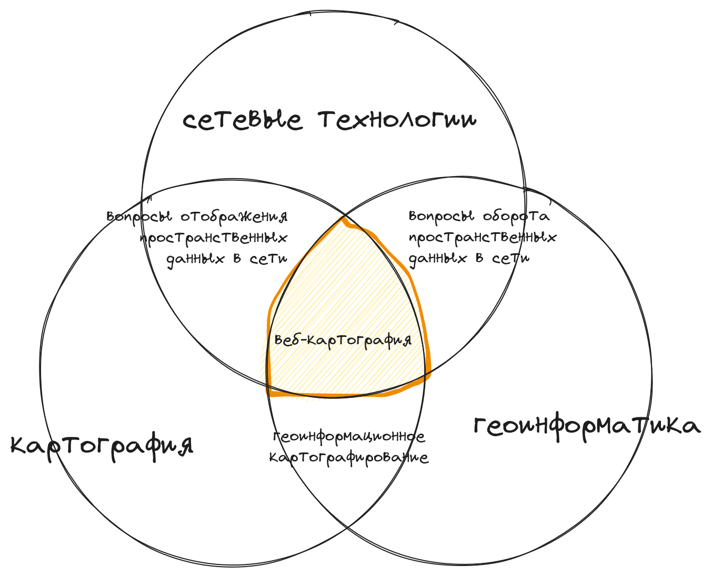

import { Card, LinkCard } from '@astrojs/starlight/components';
import Question from '../../../components/Question.astro'

Этот раздел содержит краткий *теоретический обзор* сферы веб-картографии

<LinkCard title='Руки чешутся' href='/chapters/2-webmap#создание-первой-веб-карты' description='Сразу перейти к практическому упражнению'/>

## Определение веб-картографирования

Под веб-картографированием понимается создание карт для их распространения и использования во Всемирной сети. Веб-картографирование является одним из направлений геоинформационного картографирования. Суть веб-картографирования заключается в  интеграции геоинформационных подходов к картографированию и сетевых технологий.

> Можно встретить и такие варианты употребления как «Интернет-картографирование», «WWW-картографирование», «телекоммуникационное картографирование», «web-картографирование». Однако в словаре их бы одарили меткой *устар.*

Появление большого числа картографических веб-ресурсов свидетельствует, что сетевые технологии являются одним из ключевых драйверов эволюции геоинформационной картографии.

## Особенности веб-картографирования

Веб-картографирование наследует особенности геоинформационного картографирования и обладает собственными характерными чертами, к которым относятся:

1. Сетевая среда распространения
2. Интерактивность
3. Мультимасштабность

**Сетевая среда распространения** меняет подход к публикации картографических произведений. Карта генерируется для пользователя в момент запроса, поэтому обновление картографического содержания можно выполнять непрерывно без дополнительных действий пользователя. Например, изменение границ или переименование улиц не требует приобретения пользователем нового издания картографического произведения: если данные в картографическом произведении обновились, пользователь получит их при новом запросе.

Лучшие практики веб-разработки стимулируют активное использование **интерактивности** в картографическом произведении. Хотя возможности введения диалогового взаимодействия с картой появились на этапе компьютеризации картографии, по-настоящему доступной для широкого круга пользователей интерактивность карт стала именно с развитием Интернет-технологий. Пользователь по умолчанию ожидает возможности перемещения по карте, изменения масштаба, определения координат точки и получения дополнительной информации об объекте по клику. Часто веб-карта предоставляет и более широкие возможности, например, интерактивное изменение содержания карты, оформления слоёв, проекции, компоновки.

Одним из ключевых элементов интерактивности является функция изменения масштаба картографического изображения. Это требует от автора карты формирования **мультимасштабного** содержания или явного обозначения масштабов, которые соответствуют содержанию карты. Работа с мультимасштабным содержанием веб-карт должна начинаться на этапе проектирования.

Легко заметить соподчинённость выделенных особенностей. Веб-технологии способствуют вводу интерактивности в употребление. Активное использование интерактивности обуславливает мультимасштабность картографического содержания.

Кроме того веб-картографирование характеризуют

4. Общедоступность
5. Сходство с программным обеспечением
6. Расширение выразительности

Веб-ресурсы во Всемирной сети обычно являются **общедоступными**: обратиться к ним может любой пользователь, имеющий выход в Интернет. Возможно ограничение доступа к веб-ресурсу, например с помощью системы авторизации, однако сохраняется принципиальная доступность при наличии соответствующих прав. Картографические произведения в Интернете не исключение. Коммерциализация веб-карт базируется не на платном доступе к содержанию, а на широком доступе аудитории к содержанию карты, которое можно монетизировать, например, с помощью рекламы.

На этапе проектирования картографического произведения проявляются черты, характерные для разработки **программного обеспечения** и информационных систем; составление карт сводится к написанию программного кода, который генерирует экземпляр карты для каждого пользователя; изданием картографического произведения становится его публикация на веб-сайте.

Веб-технологии расширяют круг **выразительных средств**: появляется возможность использовать мультимедийные материалы (фото, аудио, видео), давать ссылки на другие веб-страницы, создавать интерактивные картографические анимации. Технически это реализуемо и на электронных картах, локально размещаемых на компьютере пользователя, однако активное использование новых выразительных средств характерно именно для веб-карт. Карта в веб-среде становится динамичной интерактивной моделью.

<Card title='Главная особенность веб-картографрования это'>
    <Question answer="cетевая среда распространения" ballast={['интерактивность', 'использование стандартов']} explanation="Особенности веб-картографирования проистекают из сетевой среды распространения картографических материалов"/>
</Card>

Среди выделенных особенностей ключевой является сетевая среда распространения. Остальные особенности можно назвать производными от ключевой.

## Веб-картография

Наличие характерных особенностей позволяет говорить о веб-картографировании как о специфической деятельности, требующей рассмотрения в рамках отдельного направления — веб-картографии.

Реальная практика показывает, что сфера интересов веб-картографии не ограничивается изучаением процесса веб-картографирования. Это направление на пересечении картографии, геоинформатики и сетевых технологий.

Веб-картография изучает особенности оборота пространственных данных в сетевой среде. Так как эти особенности проявляются на всех этапах жизненного цикла веб-карты, то и в область интересов веб-картографии входит вся система создания-использования карт от сбора данных до чтения веб-карты пользователем. Внимание уделяется хранению, кодированию, передаче, обработке пространственных данных в сетевой среде, каталогизации и организации поиска пространственных данных, методологии разработки картографических веб-приложений, методам визуализации и интерактивного взаимодействия.

<Card title="Короче">
    Веб-картографирование — это создание карт для распространения и использования в Интернете. Оно характеризуется сетевой средой распространения и производными от этого особенностями, в частности интерактивностью и мультимасштабностью.

    Веб-картография формируется  на пересечении сетевых технологий, картографии и геоинформатики изучает особенности оборота пространственных данных в сетевой среде, включая хранение, кодирование, передачу, обработку данных, разработку веб-приложений и другие аспекты.
</Card>

---

## Литература

1. ГОСТ Р 58570-2019. Инфраструктура Пространственных Данных. Общие Требования. Стандартинформ, 2019. [ссылка](https://docs.cntd.ru/document/1200168445)
1. Абдуллин Р. К., Пономарчук А. И. Технологии интернет-картографирования: учебное пособие / Пермский государственный национальный исследовательский университет. - Пермь, 2020. – 132 с.: ил. [ссылка](https://gis.psu.ru/publications/технологии-интернет-картографирован/)
1. Берлянт А. М. Геоинформационное Картографирование. М.: Моск. гос. Ун-т им. М. В. Ломоносова, Рос. акад. естеств. наук, 1997. [ссылка](https://rusneb.ru/catalog/000199_000009_000611203/)
1. Каргашин П. Е. Основы цифровой картографии: Учебное пособие для бакалавров. 5-е изд., перераб. — Москва: Издательско-торговая корпорация Дашков и К, 2023. — 106 с. [ссылка](https://istina.msu.ru/publications/book/557759518/)
1. Лурье И.К., Самсонов Т.Е. Структура и содержание базы пространственных данных для мультимасштабного картографирования // Геодезия и картография. – 2010. – № 11. – С. 17-23. [ссылка](https://istina.msu.ru/publications/article/427465/)
1. Титов Г. С., Прасолова А. И., Каргашин П. Е. Веб-картографирование ресурсов солнечной энергии Якутии // ИнтерКарто. ИнтерГИС. — 2021. — Т. 27, № 3. — С. 210–220. [ссылка](https://istina.msu.ru/publications/article/412375618/)
1. Титов Г. С. Текущие проблемы терминологического аппарата отечественной веб-картографии // Геодезия, картография, геоинформатика и кадастры. Производство и образование : Сб. материалов IV Всероссийской науч.-практ. конф. — СПб Политехника: 2021. — С. 317–323. [ссылка](https://istina.msu.ru/publications/article/716105082/)
1. Kraak M. J. Web Cartography: Developments and Prospects. Edited by M. J. Kraak and Allan Brown. New York: Taylor & Francis, 2001. [ссылка](https://doi.org/10.1201/9781482289237)
1. Muehlenhaus I. Web Cartography: Map Design for Interactive and Mobile Devices. Boca Raton, FL: CRC Press, 2014. [ссылка](https://doi.org/10.1201/b16229)
1. Neumann A. Web Mapping and Web Cartography. In Springer Handbook of Geographic Information, edited by Wolfgang Kresse and David M. Danko, 273–87. Berlin, Heidelberg: Springer Berlin Heidelberg, 2011. [ссылка](https://doi.org/10.1007/978-3-540-72680-7_14)
1. Wind waves web atlas of the russian seas / Myslenkov S., Samsonov T., Shurygina A. et al. // Water. — 2023. — Vol. 15, no. 11. — P. 2036. [ссылка](http://dx.doi.org/10.3390/w15112036)
