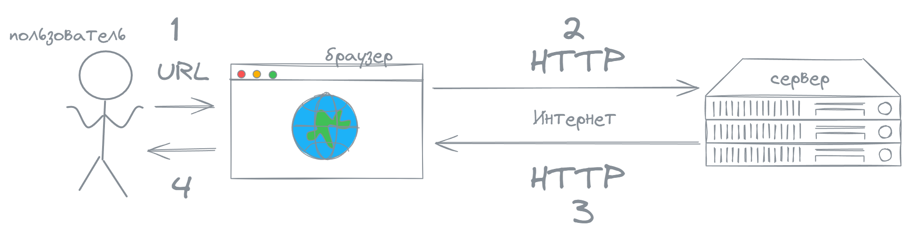
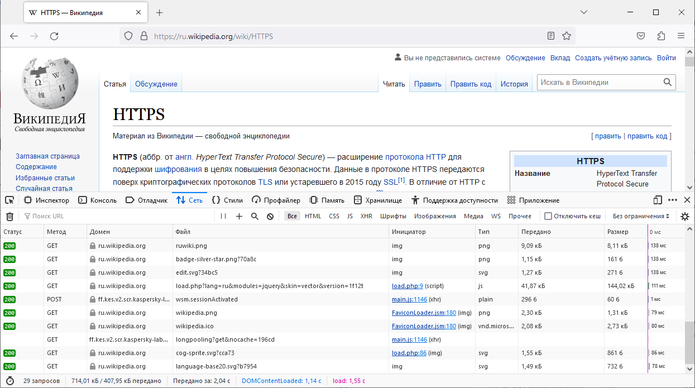
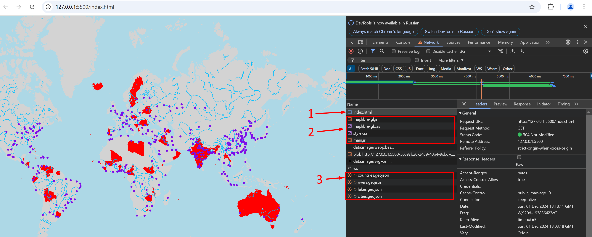

import { Card, FileTree, LinkCard } from '@astrojs/starlight/components';
import Question from '../../../components/Question.astro';

В этой главе мы рассмотрим

- понятие веб-карты
- типы веб-карт
- клиент-серверную архитектуру
- HTML, CSS, JavaScript

В рамках практической части создадим карту мира на основе статических GeoJSON-файлов.


## Карты в Интернете

Любую ли карту в Интернете можно назвать веб-картой? 

> Яндекс.Карты — конечно, да!
>
> Скан карты России, который я отправил по почте — пожалуй, нет.
>
> И между ними ещё огромное множество различных вариантов карт в Интернете.

### Определение веб-карты

Цель размещения карты в сети определяет веб-карту.

Файлам карт, передаваемым по сети, или размещаемым на сайтах, изображениям карт для печати, загрузки, иллюстрации, украшения будет отказано в праве называться веб-картой. А вот если карту разместили в Интернете для того, чтобы пользователи могли работать с ней по сети, то это веб-карта.

<Card title="Веб-карта —">это карта, предназначенная для использования в сети</Card>

### Типы веб-карт

Веб-карты можно разделить на интерактивные / неинтерактивные и статические / динамически

|                 | статические         | динамические                |
| --------------- | ------------------- | --------------------------- |
| неинтерактивные | карты-картинки      | генераторы карт-картинок    |
| интерактивные   | "простые" веб-карты | картографические приложения |

Инерактивность подразумевает возможность пользователя перемещаться по карте, менять масштаб, получать подробную информацию по клику, скрывать слои, менять цвета и так далее. Неинтерактивные карты лишены этих возможностей. Но неинтерактивная карта будет веб-картой, если предназначена для использования в Интернете.

Статические веб-карты получают данные на клиент точно в том виде, в котором они хранятся на сервере, без какой-либо обработки. Из программного обеспечения требуется только веб-сервер, который будет принимать запросы от клиентов и возвращать в ответ файлы данных с сервера клиенту.

Динамические веб-карты подразумевают серверную обработку данных и позволяют запрашивать данные более гибко. Из программного обеспечения обычно используются база данных, программа для обработки данных и веб-сервер. В общем случае веб-сервер примет запрос и обратится к программе для обработки данных, она извлечёт данные из базы, обработает их и передаст веб-серверу, который отправит подготовленные данные клиенту.

Интерактивность касается интерфейса и клиентской части, а деление на статические и динамические веб-карты связано с обработкой данных в серверной части.

<LinkCard title='Другие продукты веб-картографии' href='/chapters/7-extra#кроме-веб-карт' description='Геопорталы, картографические веб-сервисы, веб-атласы, веб-ГИС'/>

## Клиент-серверная архитектура

Рассмотрим пример работы простого веб-ресурса.



Пользователь вводит адрес запрашиваемого веб-ресурса в адресную строку браузера и нажимает клавишу Enter (1). Браузер инициирует и выполняет запрос к серверу на получение данных для создания веб-страницы (2). Сервер возвращает ответ (3). Из этого ответа браузер формирует веб-страницу, которую видит пользователь (4).

<Card title="Короче">
    Браузер -- это клиент. Сервер -- это сервер. Клиент обращается к серверу с запросом, сервер возвращает клиенту ответ. Вот суть клиент-серверной архитектуры.
</Card>

В реальности клиент может выполнять множество запросов к серверу, чтобы показать пользователю веб-страницу.

:::tip
Откройте инструменты разработчика, нажав на клавишу F12 или сочетание клавиш Ctrl+Shift+i, перейдите во вкладку Сеть (Network) и обновите страницу, чтобы увидеть, сколько запросов выполняет браузер, чтобы показать вашу любимую веб-страницу.
:::

Первый запрос инициирует пользователь выполняет путём ввода адреса. Дальнейшие действия пользователя на веб-странице могут инициировать последующие запросы. Запрашиваться могут как веб-страницы целиком, так и отдельные данные для обновления содержания текущей веб-страницы. Если мы обновляем только часть содержания веб-страницы данными с сервера, то речь идёт об асинхронном запросе.



*Запросы, выполняемые с веб-страницы*

Веб-карты тоже строятся на основе клиент-серверной архитектуры. Рассмотрим интерактивную статическую карту. 

Разметка, стили, логика (программный код) веб-карты, а также наборы пространственных данных веб-карты хранятся на сервере. Пользователь вводит адрес карты. Браузер запрашивает с сервера разметку веб-карты (html). Разметка приходит в браузер. Разметра содержит запросы к стилям и логике веб-карты. Логика веб-карты приходит в браузер и запрашивает наборы пространственных данных для создания веб-карты. Пространственные данные приходят [Взаимодействие с сервером закончено!] и кодом веб-карты превращаются в картографические слои.

<Card title='В клиент-серверной архитектуре браузер это'>
    <Question answer="клиент" ballast={['сервер', 'пользователь']} explanation="Пользователь использует браузер (клиент), чтобы выполнить запрос к серверу"/>
</Card>

## Создание первой веб-карты

Мы рассмотрели интерактивную статическую карту, а сейчас мы её сделаем своими руками!

Выделим нашей первой веб-карте отдельную папку.

> В качестве среды разработки можно использовать [VS Code](https://code.visualstudio.com/), а чтобы запустить сервер -- расширение [Live Server](https://marketplace.visualstudio.com/items?itemName=ritwickdey.LiveServer).

### Инициализация карты

Создадим файл разметки `index.html`.

```html title="index.html"
<!DOCTYPE html>
<html lang="en">

<head>
    <meta charset="UTF-8">
    <meta name="viewport" content="width=device-width, initial-scale=1.0">
    <title>Население мира</title>
    <!-- Запрашиваем стили 👇 -->
    <link rel="stylesheet" href="style.css">
    <!-- Запрашиваем библиотеку Maplibre 👇 -->
    <script src="https://unpkg.com/maplibre-gl@latest/dist/maplibre-gl.js"></script> 
    <link href="https://unpkg.com/maplibre-gl@latest/dist/maplibre-gl.css" rel="stylesheet" />
</head>

<body>
    <!-- Размечаем контейнер для карты 👇 -->
    <div id="map"></div>
    <!-- Запрашиваем логику карты 👇 -->
    <script src="main.js"></script>
</body>

</html>
```

Библиотеку Maplibre мы запрашиваем из внешнего ресурса, а вот стили и логику карты нам нужно создать.

Создадим файл стилей `style.css`.

```css title="style.css"
/* Объявляем, что контейнер карты должен занимать всю страницу */
#map {
    position: absolute;
    top: 0;
    bottom: 0;
    left: 0;
    right: 0;
}
```

И файл с логикой карты `main.js`.

```js title="main.js"
// Инициализируем карту
const map = new maplibregl.Map({
  container: 'map',
  style: "https://raw.githubusercontent.com/gtitov/basemaps/refs/heads/master/positron-nolabels.json",
  center: [51, 0],
  zoom: 4
});
```

> Наименование файла `index.html` важно тем, что именно страница `index.html` загружается при обращении к корневому URL. Наименования файлов CSS и JavaScript особой роли не играют.
>    
> Страница HTML является корневой. Ей необходимо дать информацию о том, какие внешние библиотеки и файлы будут использоваться. Например, `style.css` и `main.js` являются внешними файлами, а MapLibre является внешней библиотекой. Находящиеся на сервере файлы необходимо подключать по URL.

После этого запустим Live Server, перейдём по адресу локального сервера и увидим карту.
  
> Live Server обычно запускается по адресу `127.0.0.1:5500`. `127.0.0.1` или `localhost` -- это внутренний адрес сервера на нашем компьютере. Он будет одним и тем же у всех компьютеров. И он недоступен для запросов снаружи. На одном веб-сервере может быть запущено несколько приложений. Для их разграничения используется порт, в нашем случае `5500`.

### Добавление слоёв

Создадим подпапку `data` и загрузим в неё данные о [странах](https://raw.githubusercontent.com/gtitov/geojson-maplibre-map/refs/heads/master/data/countries.geojson), [городах](https://raw.githubusercontent.com/gtitov/geojson-maplibre-map/refs/heads/master/data/cities.geojson), [реках](https://raw.githubusercontent.com/gtitov/geojson-maplibre-map/refs/heads/master/data/rivers.geojson) и [озёрах](https://raw.githubusercontent.com/gtitov/geojson-maplibre-map/refs/heads/master/data/lakes.geojson).

Должна получится такая структура. HTML отвечает за структуру веб-страницы, CSS за оформление веб-страницы, JavaScript за логику работы веб-страницы. GeoJSON файлы хранят пространственные данные.

<FileTree>
- data/               # данные
  - cities.geojson    # города
  - countries.geojson # страны
  - lakes.geojson     # озёра
  - rivers.geojson    # реки
- index.html          # разметка
- style.css           # стили
- main.js             # логика
</FileTree>

Все действия с картой выполняются после первичной загрузки исходной карты.

Добавление картографических слоёв включает два шага: добавление источника данных `addSource` и добавление слоя `addLayer`. На первом шаге указываем, откуда мы будем брать данные, а на втором, как их оформить. Из одного источника можно создать несколько слоёв.

```js title="main.js"
// Инициализируем карту
...
map.on('load', () => {
    // Выполняется после загрузки карты
    // Добавление источника данных
     map.addSource('countries', {
        type: 'geojson',
        data: './data/countries.geojson',
        attribution: 'Natural Earth'
    })

    // Добавление слоя
    map.addLayer({
        id: 'countries-layer',
        type: 'fill',
        source: 'countries',
        paint: {
            'fill-color': 'lightgray',
        }
    })
})
```

Мы добавили полигональный слой (`type: 'fill'`). Аналогично добавляем слой линий и слой точек.


```js title="main.js"
// Инициализируем карту
...
map.on('load', () => {
    // Выполняется после загрузки карты
    ...
    map.addSource('rivers', {
        type: 'geojson',
        data: './data/rivers.geojson'
    })

    map.addLayer({
        id: 'rivers-layer',
        type: 'line',
        source: 'rivers',
        paint: {
            'line-color': '#00BFFF'
        }
    })

    map.addSource('lakes', {
        type: 'geojson',
        data: './data/lakes.geojson'
    })

    map.addLayer({
        id: 'lakes-layer',
        type: 'fill',
        source: 'lakes',
        paint: {
            'fill-color': 'lightblue',
            'fill-outline-color': '#00BFFF'
        }
    })

    map.addSource('cities', {
        type: 'geojson',
        data: './data/cities.geojson'
    })

    map.addLayer({
        id: 'cities-layer',
        type: 'circle',
        source: 'cities',
        paint: {
            'circle-color': 'rgb(123, 12, 234)',
            'circle-radius': 3
        }
    })
})
```

:::tip
Порядок отрисовки слоёв соответсвует порядку их объявления в коде. Последующие слои перекрывают предыдущие.
:::


В MapLibre слои можно фильтровать и оформлять на основе атрибутов с помощью [выражений](https://maplibre.org/maplibre-style-spec/expressions/).

Например, оставим только города с численностью населения больше 1 000 000

```diff lang="js" title="main.js"
// Инициализируем карту
...
map.on('load', () => {
    // Выполняется после загрузки карты
    ...
    map.addLayer({
        id: 'cities-layer',
        type: 'circle',
        source: 'cities',
        paint: {
            'circle-color': 'rgb(123, 12, 234)',
            'circle-radius': 3
        },
+       filter: ['>', ['get', 'POP_MAX'], 1000000]
    })
})
```

Изобразим красным (`red`) цветом страны, у которых атрибут `MAPCOLOR7` равен 1, а остальные изобразим светло-серым (`lightgray`)

```diff lang="js" title="main.js"
// Инициализируем карту
...
map.on('load', () => {
    // Выполняется после загрузки карты
    ...
    map.addLayer({
        id: 'countries-layer',
        type: 'fill',
        source: 'countries',
        paint: {
-           'fill-color': 'lightgray',
+           'fill-color': ['match', ['get', 'MAPCOLOR7'], 1, 'red', 'lightgray']
        }
    })
    ...
})
```

### Расширение интерактивности

Созданная нами карта сразу даёт пользователю возможности перемещения, зума и даже наклона (попробуйте зажать правую кнопку мыши). Однако чтобы, например, выводить атрибутивные сведения о слое по клику, надо указать это в коде.

Отследим событие клика по слою `cities-layer`. Назовём событие клика переменной `e`. Посмотрим в консоли браузера, что собой представляет это событие. Если мы отслеживаем событие клика по конкретному слою, а не по всей карте, то мы можем обратиться к набору объектов, по которым был выполнен клик `e.features`

```js title="main.js"
// Инициализируем карту
...
map.on('load', () => {
    // Выполняется после загрузки карты
    ...
    map.on('click', ['cities-layer'], (e) => {
        console.log(e)
        console.log(e.features)
    })
})
```

Закомментируем вывод в консоль и выведем по клику на слой попап.

```js title="main.js"
// Инициализируем карту
...
map.on('load', () => {
    // Выполняется после загрузки карты
    ...
    map.on('click', ['cities-layer'], (e) => {
        // console.log(e)
        // console.log(e.features)
        new maplibregl.Popup() // создадим попап
            .setLngLat(e.features[0].geometry.coordinates) // установим на координатах объекта
            .setHTML(e.features[0].properties.NAME) // заполним  текстом из атрибута с именем объекта
            .addTo(map); // добавим на карту
    })
})
```

Попап отображается, но надо показать пользователю, что на объект можно кликать. При попадании мыши на слой `cities-layer` поменяем курсор на pointer, а при покидании слоя `cities-layer` вернём значение по умолчанию.

```js title="main.js"
// Инициализируем карту
...
map.on('load', () => {
    // Выполняется после загрузки карты
    ...
    map.on('mouseenter', 'cities-layer', () => {
        map.getCanvas().style.cursor = 'pointer'
    })
    map.on('mouseleave', 'cities-layer', () => {
        map.getCanvas().style.cursor = ''
    })
})
```

В качестве завершающего штриха уберём карту подложку и добавим фон. При этом фон добавляем перед всеми слоями, так как все слои должны рисоваться после фона, поверх него.

```diff lang="js" title="main.js"
// Инициализируем карту
const map = new maplibregl.Map({
  container: 'map',
- style: "https://raw.githubusercontent.com/gtitov/basemaps/refs/heads/master/positron-nolabels.json",
+ style: {
+   "version": 8,
+   "sources": {},
+   "layers": []
+ },
  center: [51, 0],
  zoom: 4
});

map.on('load', () => {
    // Выполняется после загрузки карты
+   map.addLayer({
+       id: 'background',
+       type: 'background',
+       paint: {
+       'background-color': 'lightblue'
+       }
+   })
    ...
})
```

У нас получилась отличная карта!

При желании посмотрите [полный код](https://github.com/gtitov/geojson-maplibre-map) и [возможный результат](https://gtitov.github.io/geojson-maplibre-map/).

## Что мы получили

Откроем вкладку Сеть в инструментах разработчика и ещё разок проследим поток данных



1. Пользователь вводит адрес карты в браузере (в клиенте)
1. Клиент выполняет запрос к серверу по введённому адресу
1. Сервер обрабатывает запрос и возвращает разметку (HTML) (1)
1. В разметке содержаться запросы к офомлению (CSS), картографической библиотеке (MapLibre) и программной логике работы (JavaScript) веб-страницы (2)
1. Клиент (браузер), получив все необходимые сведения, отображает веб-страницу
1. Программная логика работы полученной веб-страницы выполняется и в соотстветвии с кодом инициирует запросы к данным (GeoJSON) для составления карты (3)
1. Полученные данные оформляются на веб-карте в рамках описанной разработчиком на языке JavaScript логики с использованием функций библиотеки MapLibre
1. Пользователь получает веб-карту
1. Веб-карта обогащается дополнительной интерактивностью в рамках описанной разработчиком логики

Такая карта удобна, когда немного данных, потому что мы всё переправляем пользователю данные как есть. Когда мы отправляем пользователю данные как есть, почти не требуется серверных мощностей, поэтому для таких карт есть варианты бесплатного размещения в Интернете.

## Упражнения

1. Покрасьте Москву в красный цвет
2. Выведите в попап один из атрибутов стран
3. Добавьте слой с границами озёр, установите им толщину в 2 пикселя
4. Замените курсор на перекрестие (`crosshair`) при расположении поверх стран

---

Титов Г. С. Введение в веб-картографию / Веб-картография : учебные материалы. Москва, 2025.